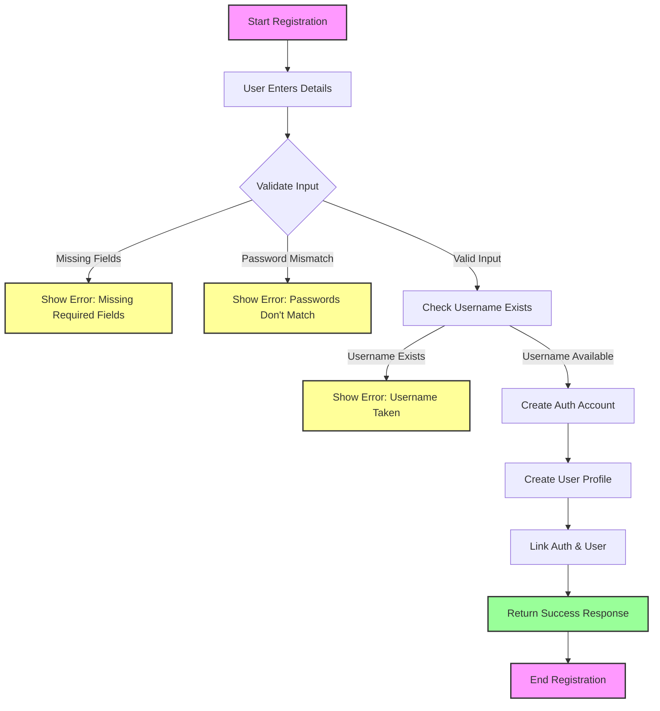

## Registration Flow Description

1. **Start Registration**
   - User initiates registration process

2. **Input Validation**
   - Check for required fields (username, password)
   - Verify password matches confirm password

3. **Username Check**
   - Verify username is not already taken

4. **Account Creation**
   - Create new auth account with role_id
   - Create new user profile
   - Link auth account with user profile

5. **Response**
   - Return success with user details
   - Return error if any step fails

## Error Cases
- Missing required fields
- Password mismatch
- Username already exists
- Server errors during creation 